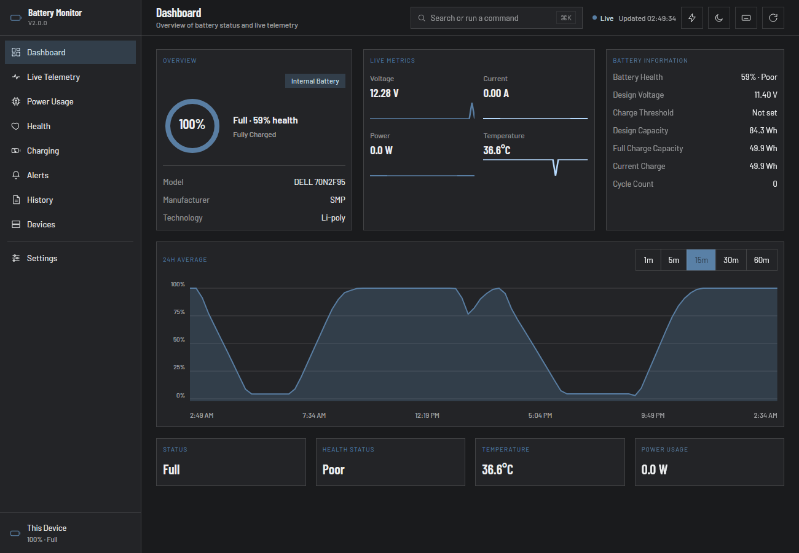
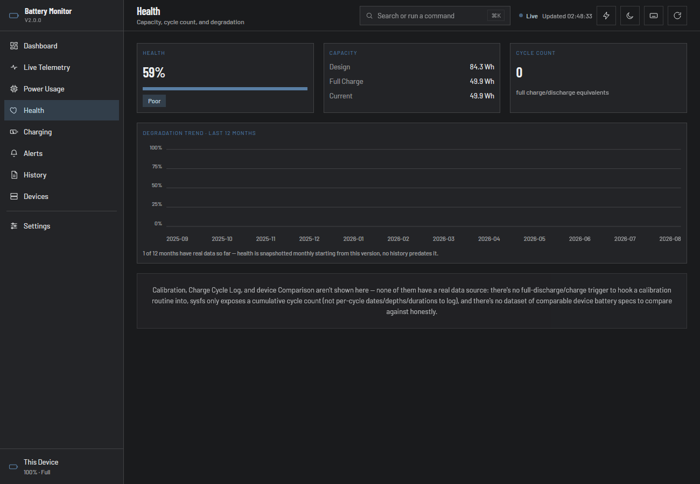
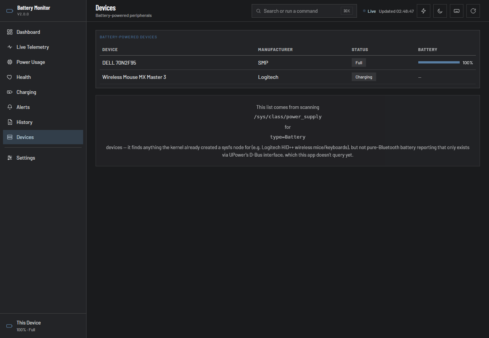

# Battery Monitor

[](https://github.com/bdkabiruddin/battery-monitor/actions/workflows/ci.yml)
[](LICENSE)

A native battery health and power dashboard for Linux laptops. Real
telemetry, real diagnostics, real history — the numbers `upower`,
`powertop`, and sysfs already know, in one window instead of scattered
across CLI tools.



<details>
<summary>More screenshots — Health trend &amp; Devices</summary>




</details>

## Why

Linux exposes a surprising amount of real battery data — voltage,
current, power draw, wear, charge thresholds, USB-C PD negotiation —
but nowhere to actually see it without piecing together sysfs paths and
CLI flags yourself. Battery Monitor reads it all in one place: a live
number where hardware actually reports one, an honest "not supported on
this hardware" where it doesn't.

## Features

**Live Dashboard** — charge percentage, status, voltage/current/power/
temperature with rolling sparklines, full battery information (design
vs. full-charge capacity, cycle count, charge threshold), and a 24-hour
capacity chart.

**Health tracking** — real health percentage from actual capacity
ratios, cycle count, and a 12-month degradation trend built from monthly
snapshots — so you can actually see wear accumulate over time, not just
a single-moment number.

**Charging diagnostics** — estimated system draw (a real 7-day
historical average, since most hardware can't report live system draw
while charging), CPU package power via Intel RAPL, active power profile,
automatic battery-saver status, live USB-C Power Delivery negotiation
(voltage/current/wattage), and charge threshold read/write on hardware
that supports it.

**Power Usage** — which processes are actually consuming CPU right now,
plus an optional deeper PowerTop scan for real per-process power impact.

**Live Telemetry** — a dual capacity/power chart over a selectable
range, plus a 24-hour discharge-intensity heatmap.

**Alerts** — an edge-triggered detector for low/critical battery, high
temperature, and abnormal power-draw spikes, with thresholds seeded from
your system's actual UPower configuration.

**Devices** — other battery-powered peripherals the kernel can see
(wireless mice, keyboards, headsets) alongside your laptop's own
battery.

**History & Reports** — CSV export of recorded telemetry for any
period, with configurable retention and automatic pruning.

**Runs quietly in the background** — closes to a system tray icon with
a live wattage/percentage label, single-instance enforced.

No telemetry, no accounts, no cloud dependency. Everything lives in a
local SQLite database on your own machine.

See **[`ROADMAP.md`](ROADMAP.md)** for the full per-screen feature
breakdown and known gaps.

## Installing

```sh
curl -fsSL https://raw.githubusercontent.com/bdkabiruddin/battery-monitor/main/install.sh | sh
```

Fetches the latest release and installs the `.deb` on apt-based
distros (Ubuntu, Debian, Mint, ...), or falls back to the `.AppImage`
elsewhere. [Read the script](install.sh) before piping it to a shell if
you'd rather not trust a one-liner — it's short.

Prefer to do it by hand? Grab a `.deb` or `.AppImage` directly from
[Releases](https://github.com/bdkabiruddin/battery-monitor/releases).

## Building from source

```sh
git clone https://github.com/bdkabiruddin/battery-monitor
cd battery-monitor

# Needs the Tauri Linux prerequisites: webkit2gtk-4.1-dev,
# libayatana-appindicator3-dev, librsvg2-dev, build-essential, libssl-dev
cd app && cargo run
```

## How it works

- **[`core/`](core)** (`battery-core`) — a data-layer library with no
  UI code of its own, reading directly from
  `/sys/class/power_supply/BAT*/*`, `ps`, `power-profiles-daemon`,
  GNOME Settings Daemon/UPower, USB-C PD sysfs, and Intel RAPL, plus
  (behind a `pkexec` prompt) `powertop`, and a SQLite history store.
- **[`app/`](app)** — the Tauri 2 backend: a background thread polls
  the battery every second, everything else is fetched on demand as
  you navigate.
- **[`frontend/`](frontend)** — plain HTML/CSS/JS, no framework, no
  build step.

Nothing in the app fabricates data — a feature either shows a real
reading or an honest "—" / "not implemented" placeholder, and every
omission is explained inline rather than silently missing.

## Project structure

```
core/                   battery-core: the data layer (no UI)
app/                    Tauri 2 Rust backend
frontend/               HTML/CSS/JS frontend (no build step)
.github/                CI workflow, issue/PR templates
SECURITY.md             Vulnerability reporting, privilege/network scope
```

## Support

If this is useful to you, consider [sponsoring on GitHub](https://github.com/sponsors/bdkabiruddin).

## License

[MIT](LICENSE)
